# 🧬 Sanger aDNA Damage Pipeline

[](https://opensource.org/licenses/MIT)
[](https://www.python.org/downloads/)
[](docs/)

A comprehensive pipeline for processing Sanger sequencing data from ancient DNA (aDNA) samples, with automatic damage pattern analysis, enhanced quality control, and diversity assessment for optimal haplogroup classification.

> [!IMPORTANT]
> **🚨 IMPORTANT DISCLAIMER - Tool Purpose & Limitations**
>
> This pipeline is **NOT** a tool for authenticating ancient DNA samples. It is designed for:
>
> - **Prioritizing haplogroups** for follow-up analysis
> - **Evaluating sample quality** based on insert size and damage patterns
> - **Providing surrogate bootstrapped damage indicators**
> - **Assisting in haplogroup origin assessment**
> - **Guiding selection** of promising samples for NGS sequencing
>
> **⚠️ All ancient DNA authentication must be performed using NGS-based methods** with appropriate controls, contamination assessment, and phylogenetic analysis.
>
> This tool provides preliminary screening to help researchers prioritize samples and resources before proceeding to comprehensive NGS-based ancient DNA authentication workflows.

## 🚀 Quick Start

### Installation

```bash
# Clone and install
git clone https://github.com/yourusername/sanger_adna_damage.git
cd sanger_adna_damage
pip install -r requirements.txt
```

### Basic Usage

```bash
# 1. Run the complete pipeline (processes AB1 files → consensus sequences)
python scripts/run_pipeline.py run-pipeline \
    --input-dir ./input \
    --output-dir ./output_q30 \
    --quality 30 \
    --verbose

# 2. Generate comprehensive HTML QC report with damage analysis
python generate_report.py ./output_q30

# 3. Enhanced Quality Control Pipeline (NEW!)
# Apply advanced aDNA cleaning and quality filtering
python enhanced_hsd_converter.py

# 4. Test primer pair detection
python tests/test_primer_pairs.py input/sample.ab1 --verbose
```

**🆕 Enhanced Quality Control Workflow:**

```bash
# Step 1: Run standard pipeline
python scripts/run_pipeline.py run-pipeline \
    --input-dir ./input \
    --output-dir ./output_q30 \
    --quality 30 \
    --verbose

# Step 2: Apply enhanced quality control (automatic aDNA cleaning + filtering)
python enhanced_hsd_converter.py

# Results:
# - output_q30_final_cleaned.fasta: Cleaned consensus sequences
# - output_q30_final_high_quality.hsd: High-quality HSD file
# - Diversity analysis report with quality metrics
```

**Complete Standard Workflow:**

```bash
# Step 1: Process your AB1 files
python scripts/run_pipeline.py run-pipeline \
    --input-dir ./input \
    --output-dir ./output_q30 \
    --config config/default_config.yaml

# Step 2: Generate comprehensive HTML report
python generate_report.py ./output_q30

# Step 3: Create HSD file for HaploGrep
python convert_hvs_consensus_to_hsd.py ./output_q30/consensus/ haplogroups.hsd

# Your results:
# - HTML Report: output_q30/reports/sanger_qc_report_YYYYMMDD_HHMMSS.html
# - HSD File: haplogroups.hsd (ready for HaploGrep upload)
```

**Single Sample Processing:**

```bash
# Convert single AB1 file
python -m src.sanger_pipeline.cli.main convert-ab1 \
    sample.ab1 output.fasta \
    --min-quality 30 \
    --min-sequence-length 30
```

## � Pipeline Workflow

The pipeline processes Sanger sequencing data through several quality-controlled stages:

```mermaid
graph TB
    A[📁 AB1 Files] --> B[🔄 AB1 Conversion]
    B --> C[🧹 Quality Filtering]
    C --> D[🔗 Consensus Building]
    D --> E[🧩 Region Merging]
    E --> F[🧬 Damage Analysis]
    F --> G[📊 QC Reports]
    
    H[✨ Enhanced QC] --> I[🧪 aDNA Cleaning]
    I --> J[📝 HSD Conversion]
    J --> K[📈 Diversity Analysis]
    
    E -.-> H
    G --> L[🎯 Final Results]
    K --> L
    
    style A fill:#e1f5fe
    style L fill:#c8e6c9
    style H fill:#fff3e0
```



### **Core Pipeline Steps:**

1. **AB1 Conversion**: Converts proprietary AB1 files to FASTA format with quality filtering
2. **Quality Control**: Filters sequences based on Phred scores and length requirements  
3. **Consensus Building**: Builds consensus sequences for each HVS region using alignment algorithms
4. **Region Merging**: Combines multiple HVS regions per sample when available
5. **Damage Analysis**: Analyzes ancient DNA damage patterns with statistical validation
6. **Report Generation**: Creates comprehensive QC reports with interactive visualizations

### **Enhanced Quality Control** (v2.0+)

- **aDNA-Specific Cleaning**: Removes ancient DNA artifacts and damage patterns
- **Advanced HSD Conversion**: Reference-aware variant calling with quality metrics
- **Diversity Analysis**: Comprehensive haplogroup diversity assessment

The pipeline supports both standard and **enhanced quality control workflows** optimized for ancient DNA analysis.

## �📚 Documentation

📖 **[Complete Documentation](https://allysson.dev.br/sanger_adna_damage/)** - Comprehensive guides, tutorials, and API reference

**Quick Links:**

- [Installation Guide](https://allysson.dev.br/sanger_adna_damage/installation.html) - Detailed setup instructions
- [Usage Tutorial](https://allysson.dev.br/sanger_adna_damage/quickstart.html) - Step-by-step workflow guide  
- [Configuration](https://allysson.dev.br/sanger_adna_damage/configuration.html) - Customization options
- [API Reference](https://allysson.dev.br/sanger_adna_damage/api/) - Function and parameter documentation
- [Examples](https://allysson.dev.br/sanger_adna_damage/tutorials/) - Real-world use cases
- [Troubleshooting](https://allysson.dev.br/sanger_adna_damage/troubleshooting.html) - Common issues and solutions

## ✨ Key Features

### 🔬 **Core Pipeline**

- **📊 AB1 Processing** - Convert Sanger files to FASTQ with quality scores
- **🔗 Consensus Generation** - Merge forward/reverse reads intelligently  
- **📈 Quality Control** - Comprehensive QC reports with visualizations
- **🧪 Damage Analysis** - Bootstrap analysis of aDNA damage patterns
- **🔧 Automated Pipeline** - Single-command execution

### 🆕 **Enhanced Quality Control (NEW!)**

- **🧬 aDNA Sequence Cleaning** - Removes ancient DNA artifacts and ambiguous nucleotides
- **⚡ Quality Filtering** - Advanced filtering with configurable thresholds (70% default)
- **📊 Diversity Analysis** - Comprehensive genetic diversity assessment and sample comparison
- **🎯 Sample Prioritization** - Identifies highest-quality samples for downstream analysis
- **📋 Quality Metrics** - Detailed reports on variant counts, similarity, and potential issues

### 🔬 **HSD Conversion Methods**

- **🏆 Regional Hybrid Method** - Optimal approach with 52.4 avg variants/sample (recommended)
- **⚠️ Direct Method** - Alternative approach with 66.0 avg variants/sample
- **🚀 Enhanced Converter** - Improved quality control and artifact detection

## 🏗️ Development

```bash
# Development setup
git clone https://github.com/yourusername/sanger_adna_damage.git
cd sanger_adna_damage

# Set up virtual environment
python -m venv venv
source venv/bin/activate  # On Windows: venv\Scripts\activate

# Install dependencies
pip install -r requirements.txt

# Run tests
python -m pytest tests/

# Generate documentation
cd docs && python -m sphinx.cmd.build source _build
```

## 🧬 Haplogroup Classification

After processing samples through the pipeline, you can convert the consensus sequences to HSD format for haplogroup classification using [HaploGrep](https://haplogrep.i-med.ac.at/):

### Standard HSD Conversion

```bash
# Convert pipeline output to HSD format (regional hybrid method - recommended)
python convert_hvs_consensus_to_hsd.py ./output_q30/consensus/ my_samples.hsd

# Upload the resulting .hsd file to HaploGrep for haplogroup analysis
```

### Enhanced Quality Control Pipeline

```bash
# Apply enhanced quality control for optimal results
python enhanced_hsd_converter.py

# Results:
# - output_q30_final_high_quality.hsd: High-quality filtered HSD file
# - Diversity analysis report with quality metrics
```

**Key Features:**

- ✅ **Regional Processing** - Independent HVS1, HVS2, and HVS3 processing
- ✅ **Artifact Removal** - Advanced ancient DNA artifact detection and cleaning
- ✅ **Quality Filtering** - Configurable quality thresholds (70% default)
- ✅ **Variant Optimization** - Produces optimal variant counts (52.4 avg/sample)
- ✅ **Diversity Analysis** - Comprehensive genetic diversity assessment
- ✅ **Sample Prioritization** - Identifies highest-quality samples
- ✅ **HaploGrep Compatible** - Direct upload to HaploGrep analysis workflow

**Quality Control Metrics:**

- 📊 **Variant Range**: 85-234 variants per sample (mean: 186.8)
- 🎯 **Sample Retention**: ~60% of highest-quality samples retained
- 📈 **Genetic Diversity**: Mean sample similarity of 5.96%
- ⚠️ **Quality Flags**: Automatic detection of low-quality samples

See the [Contributing Guide](https://allysson.dev.br/sanger_adna_damage/contributing.html) for development workflows.

## 📝 License

MIT License - see [LICENSE](LICENSE) for details.

## 🆘 Support

- 📖 [Documentation](https://allysson.dev.br/sanger_adna_damage/) - Complete guides and references
- 🐛 [Issues](https://github.com/yourusername/sanger_adna_damage/issues) - Bug reports and feature requests
- 💬 [Discussions](https://github.com/yourusername/sanger_adna_damage/discussions) - Questions and community
